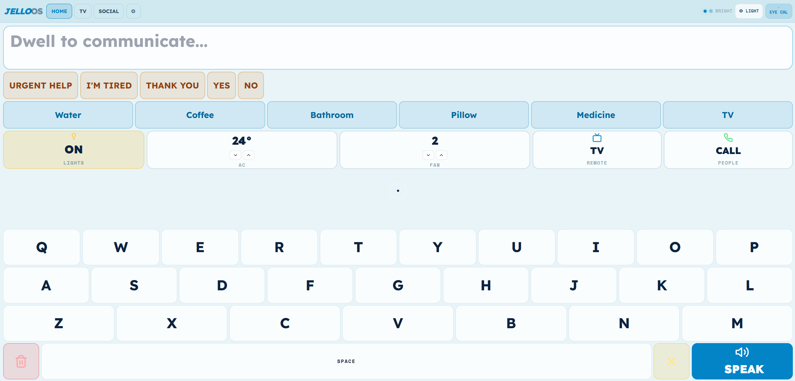
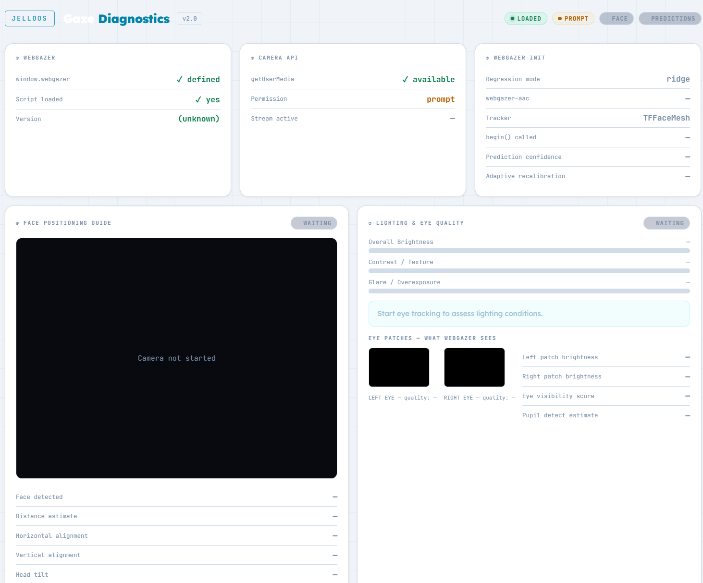
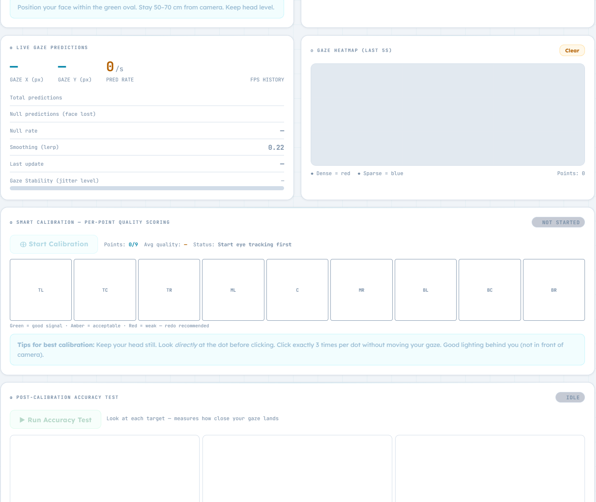
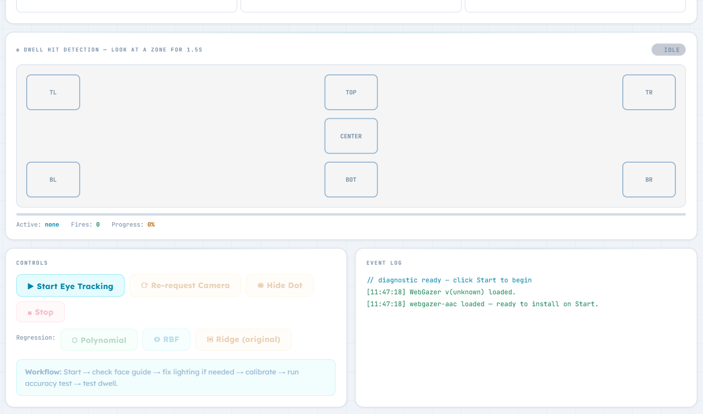
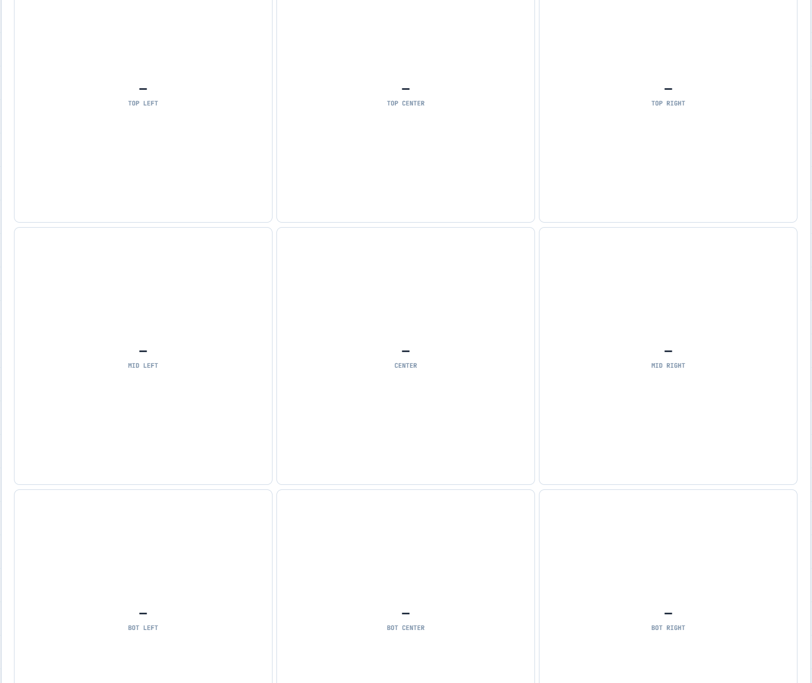

# JelloOS

**Eye-tracking AAC for people who communicate with their gaze.**

JelloOS is a sovereign, installation-free augmentative and alternative communication (AAC) interface built for individuals with motor impairments. It runs entirely in the browser — no app store, no installation, no data leaving the device. You open it, calibrate, and communicate.

Built by [ALTRU.dev](https://altru.dev) — Code for Humanity · GPLv3

---



---

## What it does

JelloOS turns a standard webcam into a communication device. The user looks at keys or phrases on screen; after holding their gaze for a configurable dwell period (default 1.2 seconds), the key activates. Built text is read aloud via the browser's speech synthesis engine.

**Core features:**

- **Gaze keyboard** — full QWERTY layout, dwell-activated, no physical input required
- **Quick phrases** — urgent phrases (URGENT HELP, I'M TIRED, THANK YOU, YES, NO) always visible at the top
- **Phrase categories** — context tiles for Water, Coffee, Bathroom, Pillow, Medicine, TV and more
- **Smart home controls** — dwell-activated Lights, AC, Fan, TV Remote, and People Call tiles
- **AI word prediction** — Gemini-powered next-word suggestions update as you type
- **Jello cursor** — soft spring-physics gaze indicator with real-time visual feedback
- **Camera-based ambient light theming** — samples the webcam feed every 2.5 seconds and automatically switches between night / dim / dusk / day themes
- **Speech output** — one-button speak with configurable voice
- **Mouse simulation mode** — full fallback for development and demonstration without a camera
- **Gaze diagnostics tool** — separate page for setup, calibration quality scoring, and live accuracy testing

---

## Screenshots

### Main interface


The main screen. Quick phrases at top, environment control tiles in the middle, full gaze keyboard below. The dot in the centre is the Jello cursor — it follows your gaze with spring physics.

---

### Gaze diagnostics — setup panel



The diagnostics tool opens in a separate page. Left to right: WebGazer load status, camera permission state, and the WebGazer Init panel showing active regression mode, webgazer-aac version, prediction confidence, and adaptive recalibration status. Below: live face positioning guide with camera feed, and the lighting + eye quality meters.

---

### Gaze diagnostics — calibration and heatmap



Live gaze prediction stats (X/Y coordinates, FPS, null rate, stability), rolling 5-second heatmap, 9-point smart calibration with per-point quality scoring (green = good, amber = acceptable, red = redo), and post-calibration accuracy test.

---

### Post-calibration accuracy test



After calibration, the accuracy test measures actual pixel error per screen zone. Look at each target for 1.5 seconds; the tool reports error radius per quadrant so you know exactly where the model performs well and where it needs more calibration points.

---

### Dwell hit detection and controls



The dwell hit arena (top) tests gaze activation across 7 screen zones before using the main app. The controls panel (bottom) shows the regression switcher — swap between Polynomial, RBF, and Ridge regression live. The event log on the right shows webgazer-aac install status and calibration events.

---

## Quick start (single-file, no build needed)

JelloOS ships as a self-contained `index.html`. Open it in Chrome or Edge on any device with a webcam:

```bash
# Clone the repo
git clone https://github.com/altrudev/JelloOS.git
cd JelloOS

# Serve locally (required — camera needs HTTPS or localhost)
npx serve .
# or: python3 -m http.server 8080

# Open in browser
open http://localhost:8080
```

> **Important:** Camera access requires either `localhost` or an HTTPS origin. Opening `index.html` as a `file://` URL will not work.

### API key

AI word prediction uses the Gemini API. Create a `.env.local` file:

```
VITE_GEMINI_API_KEY=your_key_here
```

If no key is provided, word prediction is silently disabled — the rest of the app works fine without it.

---

## Development (React + Vite)

The `index.html` is the self-contained production build. The React source is in the repo for modification:

```bash
npm install
npm run dev     # hot-reload dev server at localhost:5173
npm run build   # outputs to dist/
```

**Stack:** React 19 · TypeScript · Vite 6 · WebGazer.js · webgazer-aac · Gemini API (`@google/genai`) · Lucide icons

---

## Calibration guide

Good calibration is the single biggest factor in accuracy. Use the [Gaze Diagnostics tool](https://github.com/altrudev/JelloOS/blob/main/gaze-diagnostics.html) first — it will tell you if your lighting and face position are suitable before you spend time calibrating.

**Setup steps:**

1. **Position your face** 50–70 cm from the camera, centred in the frame
2. **Lighting** — light should come from in front of you (a lamp near the monitor). Avoid bright windows or lights behind you
3. **Open the diagnostics tool** — check the face guide, lighting meters, and eye quality scores before calibrating
4. **Use all 9 calibration points** — look directly at each dot and hold your gaze steady before clicking
5. **Check the per-point quality grid** — amber or red points should be redone before proceeding
6. **Run the accuracy test** — the 9-zone test shows actual pixel error per screen quadrant after calibration

**Realistic accuracy with webgazer-aac:**

| Setup | Typical error radius |
|---|---|
| Poor lighting / bad position | 200–300 px |
| Good conditions, default WebGazer | 150–200 px |
| Good conditions + webgazer-aac | 80–130 px |
| + adaptive recalibration (10 min session) | 60–100 px |

Keyboard keys are sized at 120 px+ minimum. Phrase tiles are larger. Design assumes ~100 px error radius under good conditions.

---

## Gaze diagnostics tool

Open [`gaze-diagnostics.html`](https://github.com/altrudev/JelloOS/blob/main/gaze-diagnostics.html) for setup and troubleshooting. It runs independently alongside the main app — no build needed.

**Panels:**

| Panel | What it shows |
|---|---|
| WebGazer status | Script load, version, window object |
| Camera API | getUserMedia availability, permission state, stream active |
| WebGazer Init | Regression mode, webgazer-aac version, prediction confidence, adaptive recalibration status |
| Face positioning guide | Live mirrored camera feed, face detected, distance estimate, alignment, head tilt |
| Lighting & eye quality | Brightness, contrast/texture, glare meters + plain-language advice |
| Eye patches | Left and right eye as WebGazer sees them, per-eye quality score, pupil detect estimate |
| Live gaze predictions | X/Y coordinates, FPS, null rate, stability score, FPS history spark |
| Gaze heatmap | Rolling 5-second heatmap — red = dense fixation, blue = sparse |
| Smart calibration | 9-point grid with per-point quality scoring, redo weak points |
| Accuracy test | Post-calibration 9-zone error measurement |
| Dwell hit arena | 7-zone dwell test before using the main app |
| Controls | Start/stop, regression switcher (Polynomial / RBF / Ridge), event log |

---

## Settings

Accessible via the ⚙ button or by dwelling on the settings tile:

| Setting | Default | Description |
|---|---|---|
| Dwell time | 1200 ms | How long to hold gaze before activation |
| Sensitivity | 0.5 | Gaze target hit radius multiplier |
| Voice | System default | Speech synthesis voice |
| Eye tracking | Off | Toggle between gaze and mouse simulation |
| Auto face light | On | Adjusts screen brightness to help the camera in low light |

---

## webgazer-aac integration

JelloOS ships with [webgazer-aac](https://github.com/altrudev/webgazer-aac) — an accessibility-first patch layer over WebGazer.js. It loads from `webgazer-aac.js` in the same directory and is installed automatically when eye tracking starts.

**What it adds over stock WebGazer:**

- Polynomial and RBF regression — models screen-corner distortion that linear ridge can't handle
- Ensemble blending — weights polynomial and RBF by their rolling error; the better model gets more influence
- Kalman filter — separates real movement from jitter; much steadier than EMA
- Blink detection — passes `null` during blinks so dwell timers don't advance falsely
- Saccade suppression — coasts on the Kalman prediction during fast eye movements
- Per-user PCA basis — fitted from your calibration patches at the end of setup
- Adaptive recalibration — every confirmed dwell hit silently improves the model

To update webgazer-aac, replace `webgazer-aac.js` with the latest from [altrudev/webgazer-aac](https://github.com/altrudev/webgazer-aac).

---

## File structure

```
JelloOS/
├── index.html              # Self-contained production app (open this)
├── gaze-diagnostics.html   # Standalone gaze diagnostics tool
├── webgazer-aac.js         # Eye tracking enhancement layer
├── App.tsx                 # Root React component
├── index.tsx               # Entry point
├── types.ts                # TypeScript interfaces and enums
├── vite.config.ts
├── tsconfig.json
├── contexts/
│   └── GazeContext.tsx     # Gaze state, dwell logic, ambient light sensing
├── components/
│   ├── GazeCursor.tsx      # Jello spring-physics cursor
│   ├── JelloButton.tsx     # Dwell-aware button primitive
│   └── Keyboard.tsx        # Gaze keyboard layout
├── services/
│   └── geminiService.ts    # Gemini word prediction
└── docs/
    ├── screenshot-main.png
    ├── screenshot-diagnostics-setup.png
    ├── screenshot-diagnostics-calibration.png
    ├── screenshot-accuracy-test.png
    └── screenshot-dwell-controls.png
```

---

## Accessibility notes

JelloOS is designed for users with:

- ALS / motor neurone disease
- Cerebral palsy
- Locked-in syndrome
- Severe RSI or limb difference
- Any condition preventing reliable physical input

The entire interface is operable with gaze alone. No keyboard, mouse, switch, or touch input is required once running.

**Design decisions for AAC users:**
- Large dwell targets (120 px+ minimum)
- Adaptive ambient light themes — the screen adjusts to help the camera see your eyes
- Blink detection prevents false activations mid-blink
- Confidence gating holds dwell progress when gaze is unstable
- All phrase content is user-editable
- Calibration can be re-run at any time from within the app

---

## Privacy

JelloOS processes all video locally in the browser. No camera frames, gaze coordinates, calibration data, or typed text are transmitted anywhere. The Gemini API receives only the current text buffer for word prediction — no video, no biometric data.

To use JelloOS with zero external network requests, leave `VITE_GEMINI_API_KEY` unset. Word prediction will be disabled; everything else works fully offline.

---

## Related

- **[webgazer-aac](https://github.com/altrudev/webgazer-aac)** — the eye tracking enhancement layer JelloOS is built on
- **[WebGazer.js](https://github.com/brownhci/WebGazer)** — the underlying eye tracking library (Brown University, 2016–2026)

---

## Contributing

Issues and PRs welcome, especially:

- Accessibility improvements
- Additional phrase libraries and languages
- Better calibration UX for motor-impaired users
- Mobile and tablet optimisations
- Hardware testing reports (dedicated eye trackers, assistive devices)

Please open an issue before large PRs.

---

## License

GPLv3 — see [LICENSE](LICENSE).

`webgazer-aac.js` is also GPLv3, same as upstream WebGazer.

If your organisation's valuation is under $1,000,000, you may use both under LGPLv3. For other arrangements, open an issue.

---

*Part of [ALTRU.dev](https://altru.dev) — free, privacy-first tools for people who need them.*
